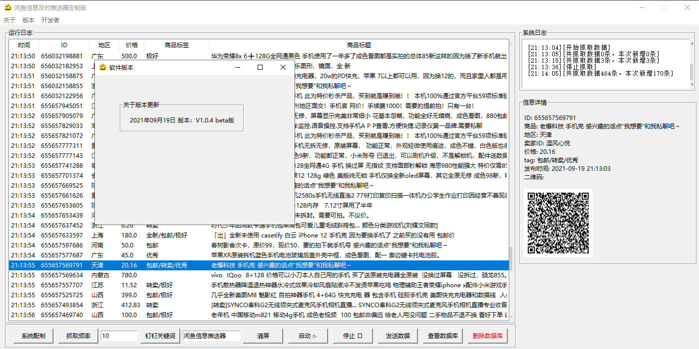
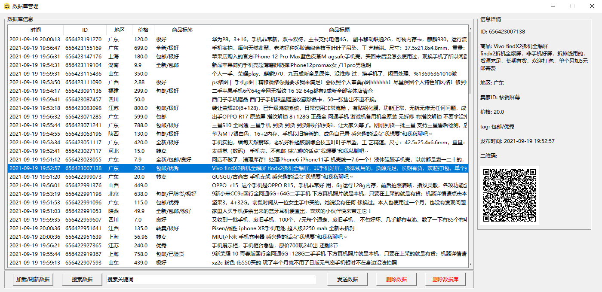
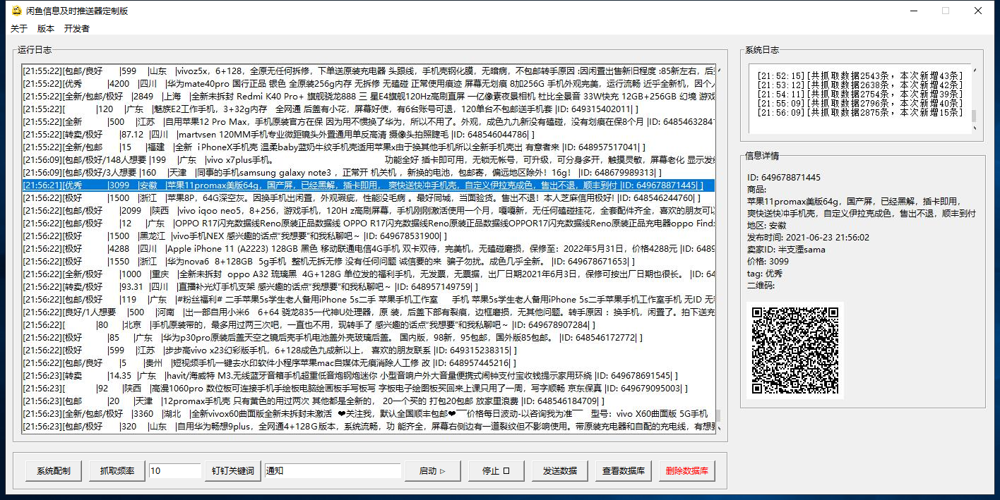
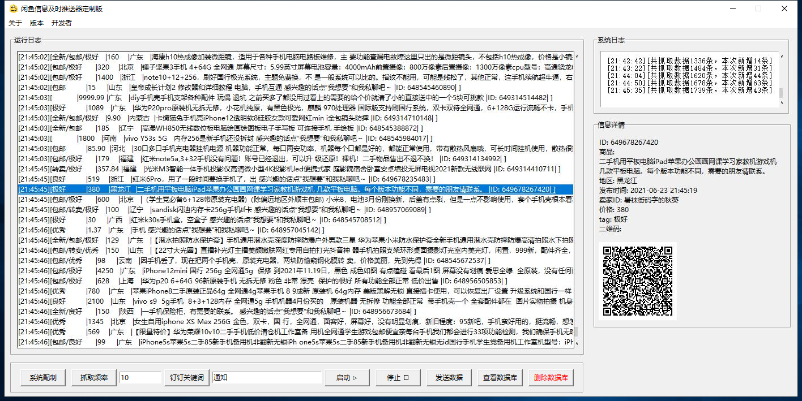
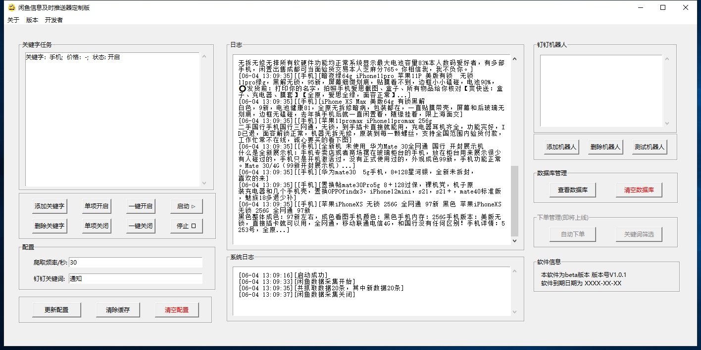
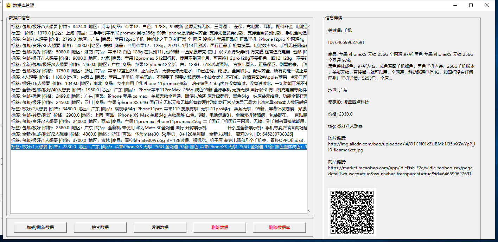

## xianyu-idlefish-spider-crawler-sender

## 闲鱼自动抓取/筛选/发送系统，xianyu spider crawler blablabla

#### 联系QQ

#### v 1.0.4更新抓取首页和数据库页面

再次更新，
将原来杂乱的列表型数据显示更新为表格，这样看起来就没有那么乱了。
更新下效果图：

#### v 1.0.3添加多终端采集

在分布式采集的基础上，再次添加同一终端上面的多线程采集，进一步提高采集效率。
采集端代码在原有基础上再次升级。

#### v 1.0.3已经升级完毕

抓取数据目前比较快的话，可以达到10秒钟入库体现，关键词多的话，会有一定延迟。

同时，数据库从本地移到服务器，开始使用远程连接和储存数据，更方便分布式搭建、站库分离，以及一服多客模式。

更重要的是，不再需要配制本地数据库，不会再因为本地数据库问题导致程序down掉。

虽然原来也写了自动化配制数据库的程序，但因为系统权限问题，始终不太理想。这次干脆干掉本地数据库，只需要一个客户端，为所欲为了。

#### v 1.0.1.2升级数据库启动文件，自动检测系统数据库配制情况。

#### 1 建议使用mongodb 4.2.14， 将mongod.exe移动到bin文件中

#### 2 运行数据库启动软件，自动建立数据库文件和日志文件。

#### 3 运行程序

