## 闲鱼自动抓取/筛选/发送系统， idlefish / xianyu spider crawler sender program blablabla

#### 联系QQ （用QQ扫二维码，或者添加QQ号）
####  - 📫 联系本人 ...

* 购买软件、收购项目，可联系本人邮箱或添加QQ

* Email: 26010455@qq.com

* QQ: 26010455（添加请注明来意 否则不予通过）

* 扫码加好友 QQ/微信（推荐QQ）

  

####  - 📫 个人项目 Projects...

1. [闲鱼自动抓取/筛选/发送系统， idlefish / xianyu spider crawler sender program blablabla](https://github.com/FightingForWhat/idlefish_xianyu_spider-crawler-sender) 可监控闲鱼最新发布商品，发送钉钉
2. [闲鱼店铺商品/用户商品抓取同步系统 idlefish_shop_user_spider_crawler](https://github.com/FightingForWhat/idlefish_shop_user_spider_crawler) 可同步闲鱼指定商户所有在售、已售商品信息。
3. [闲鱼商品详情抓取系统升级/测试完毕，可自动采集闲鱼商品详情信息 idlefishDetail](https://github.com/FightingForWhat/idlefishDetail) 可同步闲鱼商品详细信息、闲鱼卖家指定信息。
4. 闲鱼已售商品信息查询系统
5. 淘宝系x-sign请求参数研究， [闲鱼](https://github.com/FightingForWhat/idlefish-xianyu-x-sign-and-request-params) [淘宝](https://github.com/FightingForWhat/taobao_x-sign_20211028)
6. [网页淘宝数据抓取](https://github.com/FightingForWhat/TaobaoSpider) [手淘研究学习1](https://github.com/FightingForWhat/TaoBao-taobao_spider) [手淘研究学习2](https://github.com/FightingForWhat/TaoBao_Spider)

7. [AI STOCK A股量化交易工具 测试](https://github.com/FightingForWhat/AI_STOCK)

8. [探寻闲鱼SellerId加解密算法](https://github.com/FightingForWhat/IdleFish_SellerId)
9. [aweme_tiktok_comments 抖音评论抓取](https://github.com/FightingForWhat/aweme_tiktok_comments)
10. [探寻闲鱼x-sign/x-mini-wua加解密算法 Unidbg/idleFish/taobao/damai...](https://github.com/FightingForWhat/unidbg_idle_fish)
11. [探寻转转签名/算法](https://github.com/FightingForWhat/zhuanzhuan_sign)
------

#### 项目更新记录

#### 20240413更新/升级

闲鱼自动化工具——闲鱼信息筛选/推送系统 V24已经测试完毕

V24更新说明：

1、添加风控暂停/继续按钮，程序会在闲鱼风控时暂时执行，等待用户过风控后点击，会在上次运行的位置继续执行。

相对于原来从新开始执行，会省下很多数据同步的时间和效率。

2、优化和修改部分钉钉推送的队列功能。

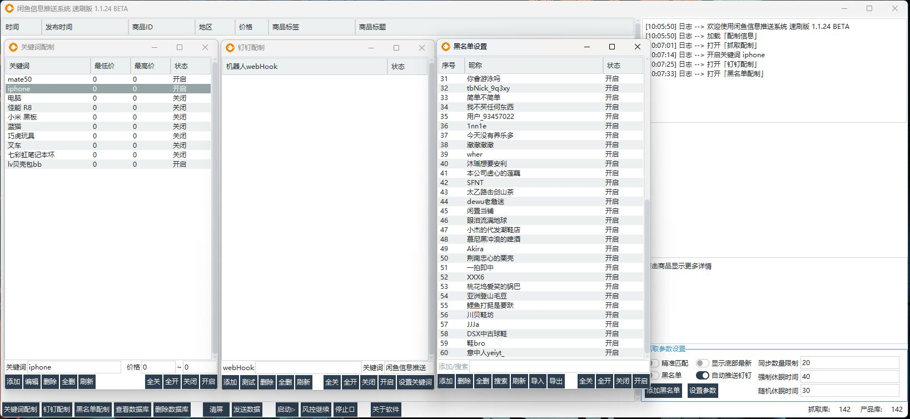

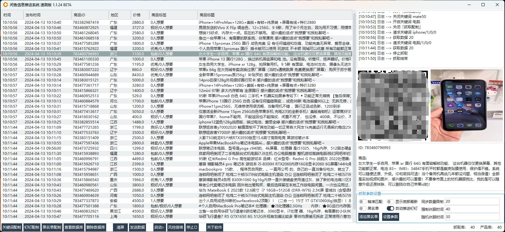

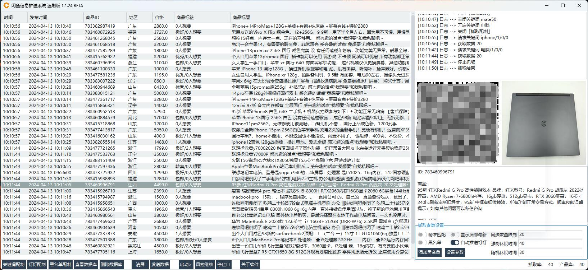

#### 20240128更新/升级

闲鱼自动化工具——闲鱼信息筛选/推送系统 V23已经测试完毕

更新说明：

因为闲鱼在最近的更新中，对相关接口做了相当地改款和优化，我个人在相关工具的维护中，也积累了相对比较多的代码更新，所以适当地推出升级款。

1、更新接口，适配最新7.14款闲鱼。虽然原来的接口也还可以用。

2、优化核心队列。

3、优化推送队列。

版本方面改版不大，继承前期版本和功能，基本没有变化。

#### 20230915更新/升级
闲鱼自动化软件——筛选/发送系统 V22已经测试完毕

主要更新点：

1、添加显示自定义按钮，可以自动显示最新数据，也可以手动翻页显示。

2、优化钉钉发送队列，更有效率地利用发送接口。

3、优化接口。

版本方面更新不大，虽然有一些想法，但并没有在这一版中更新出来。

功能方面也并没有添加其他花梢内容，没必要因为一些不会有太多人需要的功能，增加软件的逻辑，容易造成软件运行不稳定。当然，确实需要的人可以找我定制。

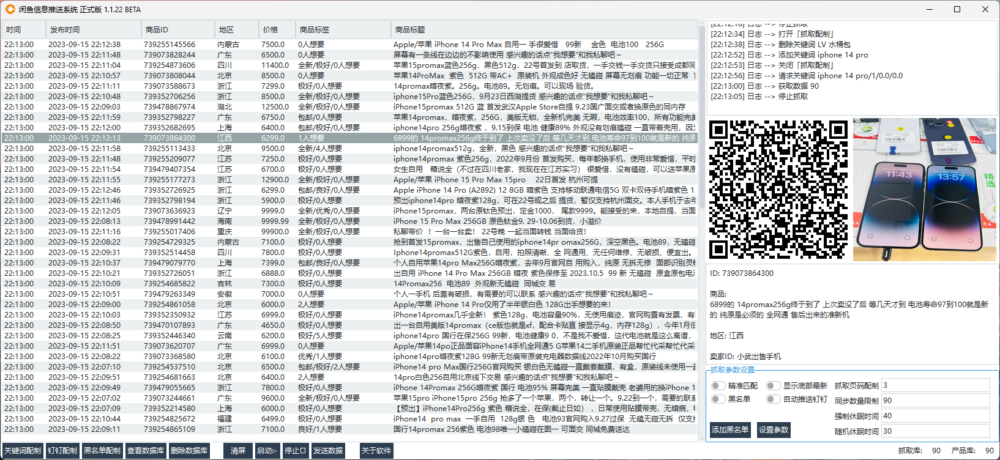
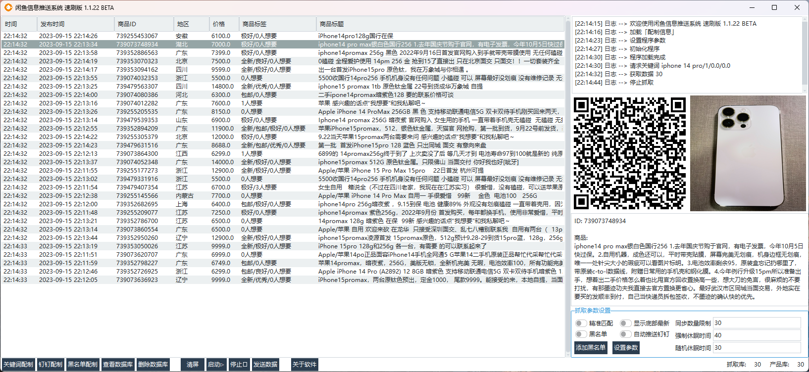

#### 20230603更新/升级
闲鱼自动化软件——筛选/发送系统 V21已经测试完毕

原来虽然使用了自动排版的代码，但当屏幕分辨率很大，用户采用比例放大的时候，界面的排版还是会有些乱。

本次升级将相关显示做了优化，再也不怕版面会乱了。

2、功能优化：

	1）加入更多细节控制开关，如是否精准匹配、是否开启黑名单、是否自动推送商品信息到钉钉。
	
	2）优化数据解析速度，将相关数据解析部分的代码做了优化，打破当前语言速度桎梏，解析大量数据时时间比原来整体提高效率2/3以上。个人测试仅序列化部分代码效率提高10倍左右。
	
	3）优化核心，在提高速度和数据解析的前提下，将核心的兼容性，执行速度再次优化。

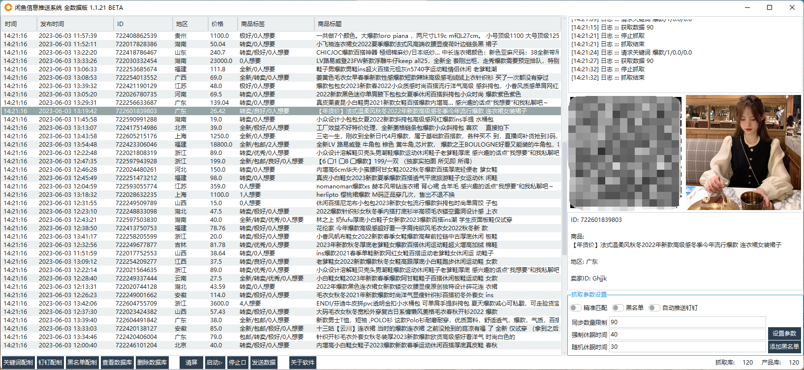

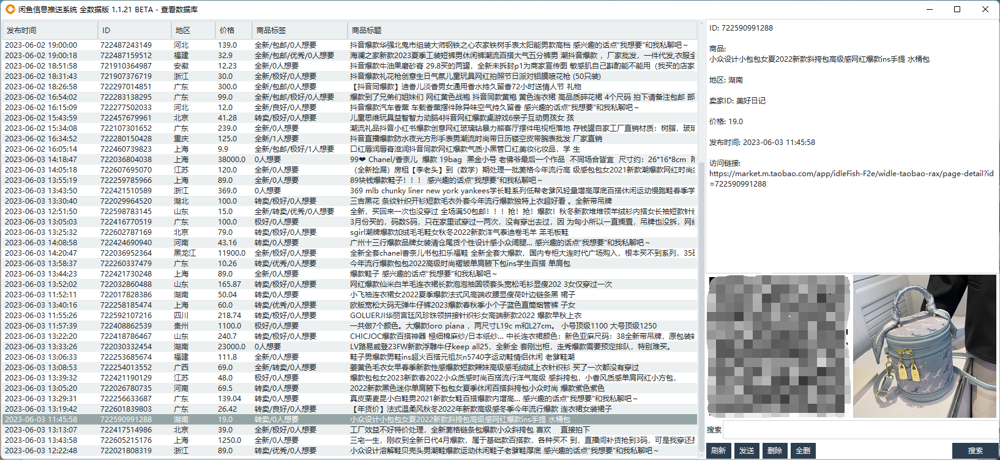

#### 20230130更新/升级
闲鱼自动化软件——筛选/发送系统 V20已经测试完毕
V20做了哪些更改或优化。

1。优化抓取：

在抓取环境优化参数，使抓取更顺滑，抓取数据效果上更准确。

2。优化/重构了界面：

原来的版本，屏幕放大后界面被破坏，一直是一个让人头痛的问题。20版在界面布局彻底重构，再也不怕放大导致的某些问题了。

3。优化核心：

V20版在优化了原核心的基础上，创新开发了不需要登录就可抓取数据的接口（目前并没有使用在预览版上，可以接受用户定制）。因为程序的某些功能还是需要登录操作，所以要看用户最终决定使用哪个版本的核心。

4。优化设置：程序增加了返回数据设置接口。返回数据多少由用户设定，减少返回数据量，可以提高抓取返回数据的效率，个人测试可以达到6-8秒。（视不同计算机算力决定）。

在版本分布上，20版和18版没有大的区别。

1) 手动版，需要设置所有参数，并由用户启动抓取相应数据，程序只响应当前参数，不做循环操作。
2） 正式版（普通版）在手动版基础上添加循环操作，参数由用户完全设定，程序自动抓取并处理相关数据。
3） 全数据版 整合之前全数据版和AI版，自动跳过闲鱼广告及空数据抓取，相对提高效率为某些不追求数据及时性，但倾向于数据更全更多的朋友。
4） 速刷版 为追求速度和最新数据的客户开发，可以抓取特定时间内（如10秒内、10分钟内）、特定Tag（如5人以下想要）的数据。
5） HTTP版， 主要为局域网内多客户端访问的朋友设计，可以一台服务，多台显示

后续开发计划：

前面说的云采集、手机app、分布式并没有开发完成，但后续计划需要再加一个功能分布式。

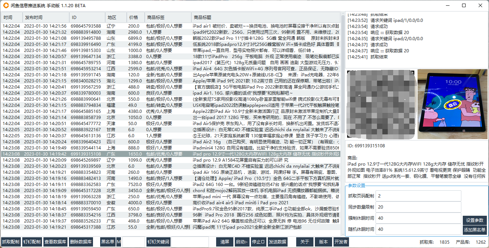

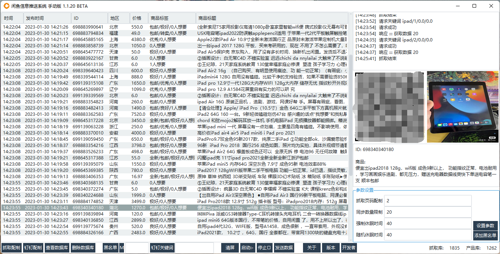

#### 1019更新/升级

v18定版，测试完成。

demo再上几张

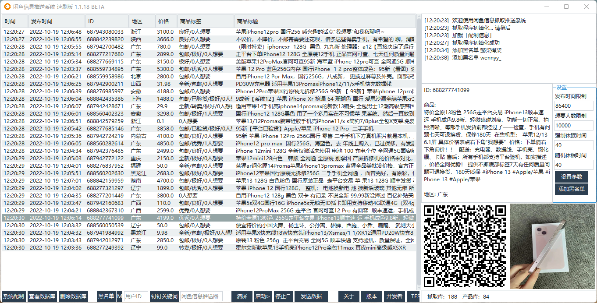

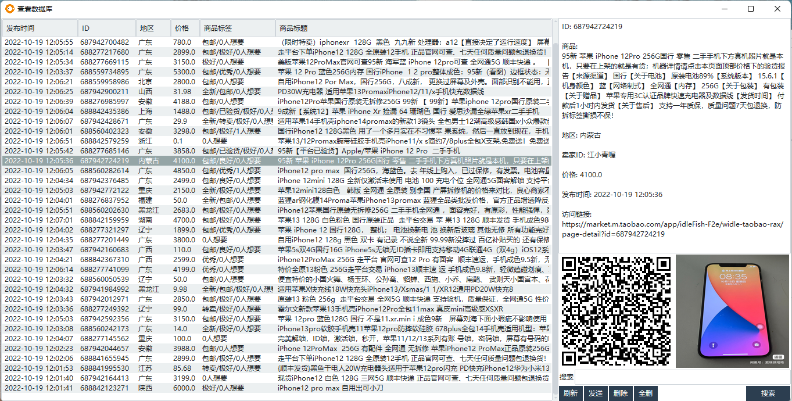

#### 1002 v18 更新/升级
一直在更新 v18，也想让v18在功能上有一个质的飞跃。

有用户订制，给的时候也比较久，所以就直接把更新了一半的18拿了出来，当是给正式版的18做个demo.

目前确定的更新内容包括：

1 更新内核， 虽然内核代码未做迭代，但运行速度提升不少。

2 更新UI，整个UI看起来更美观。（虽然和有美工的软件比起来还是很丑，但好用才是最重要的，不是吗）

3 线程优化，不仅内核线程优化，整个数据采集，筛选，显示的线程均做了优化，重写了部分线程代码。

4 个别闲鱼字段优化
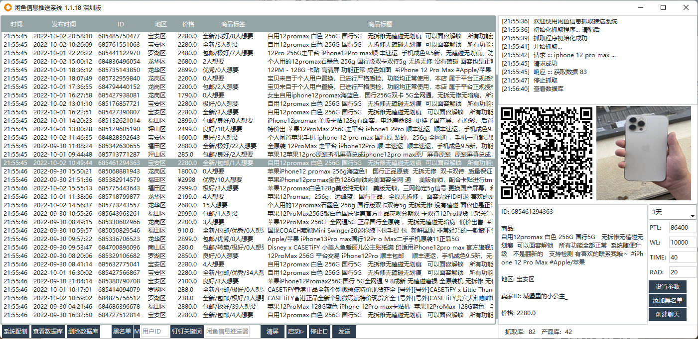

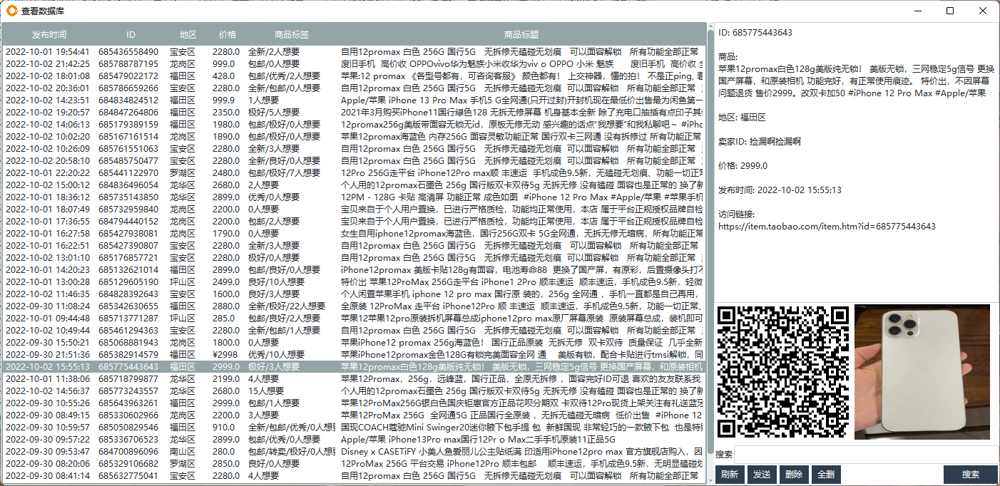

#### 0809 计划更新v18
界面已经基本做出来了

第18版除了积累了前期一些小改动，UI方面更新比较大，重写比较多。相对更美观一些。

计划将很快可以更新上线使用。

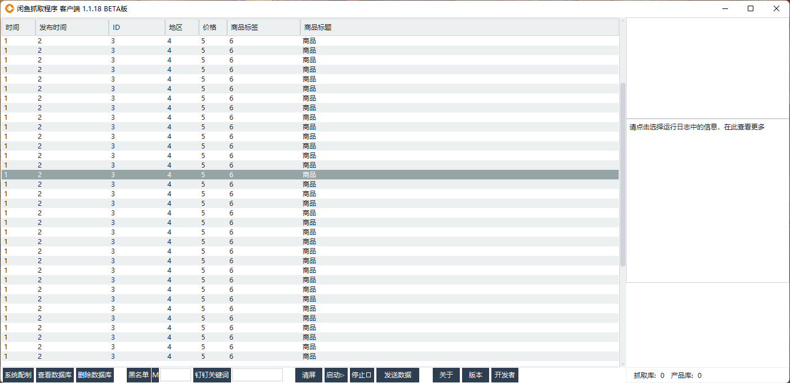

#### 0517 v 1.1.16可以稳定运行，上个demo
版本上面和13没区别，优化了内核。同时增加app端，可以手机浏览抓取结果。
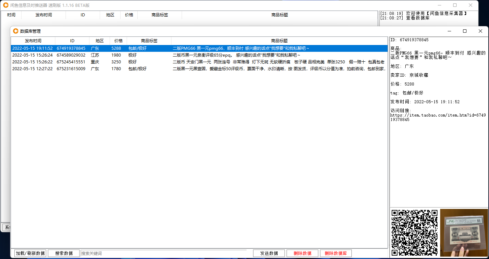

#### 0506 v 1.1.16增加手机客户端。

1.1.16版本经过14，15代集中优化，目前已经稳定运行。详细版本目前会继承1.1.13的各个版本，并添加手机客户端APP

v 1.1.16 客户端APP demo

#### 0315 v 1.1.16优化完毕，暂未上线。

1、适配最新版闲鱼至 7.3.80。

2、进一步优化采集效率。在不破解闲鱼程序，不绕闲鱼防护的前提下，进一步优化采集效率。

3、适配安卓6至10系统代码。

#### 0207 v 1.1.13可以上线了。

v 1.1.13版更新详情

1、 更新UI，更简洁，更美观。

2、 更新功能，由原来的普通版、AI两个小版本，增加到普通版（正式版）、AI版、速刷版、全数据版， 以及HTTP版。

    1） 正式版（普通版）与原来功能一样，只优化UI，及数据优化。
    
    2） AI版 增加了普通版的AI模块，自动识别闲鱼广告，自动识别关键词抓取结束。
    
    3） 速刷版 为追求速度和最新数据的客户开发，可以抓取特定时间内（如10秒内、10分钟内）、特定Tag（如5人以下想要）的数据。
    
    4） 全数据版 为某些不追求数据及时性，但倾向于数据更全更多的朋友。
    
    5） 新增加 HTTP版， 主要为局域网内多客户端访问的朋友设计，可以一台服务，多台显示。

v 1.1.13 demo

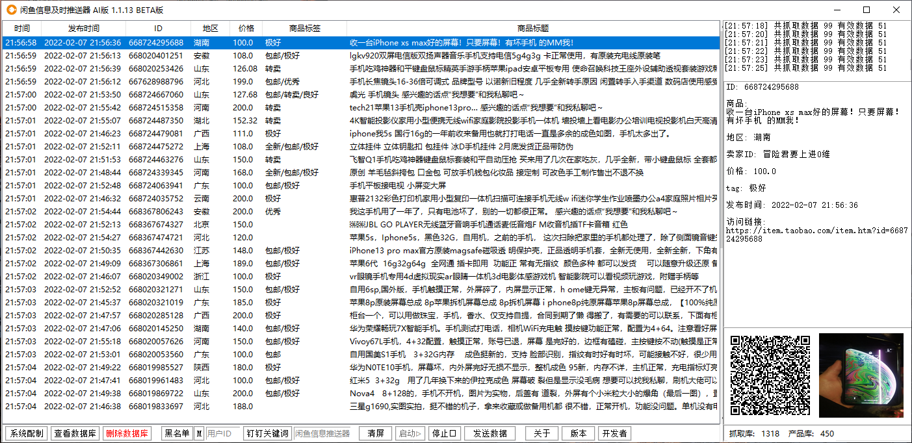

v 1.1.13 http版demo

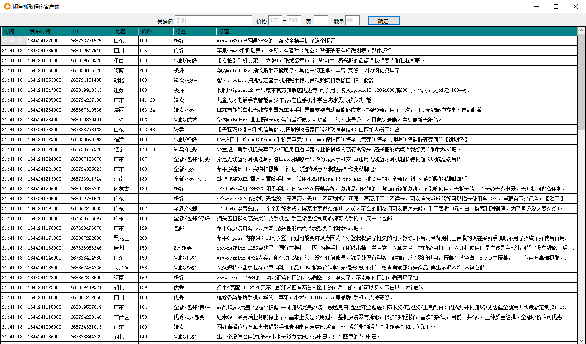

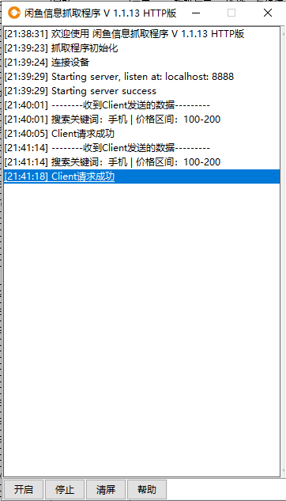

#### ---------- 2022年 更新 -------------

#### 1225 在优化基础上重构钉钉模块

#### 1225 优化数据库打开速度

#### 1225 优化钉钉发送格式模块

#### 1221 v 1.1.12 优化钉钉发送模块

#### 1213 v 1.1.12 添加AI智能模块

目前正在添加和优化AI搜索功能，可以AI智能跳过无效搜索，提高搜索效率。

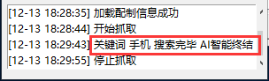

#### 1212 v 1.1.11 

版本号从1.0 过渡到1.1
整个程序模块重构。
1.0.9 添加数据库监控模块
1.1.10 模块重构， 优化搜索分词模块。
1.1.11 继续优化了搜索分词模块

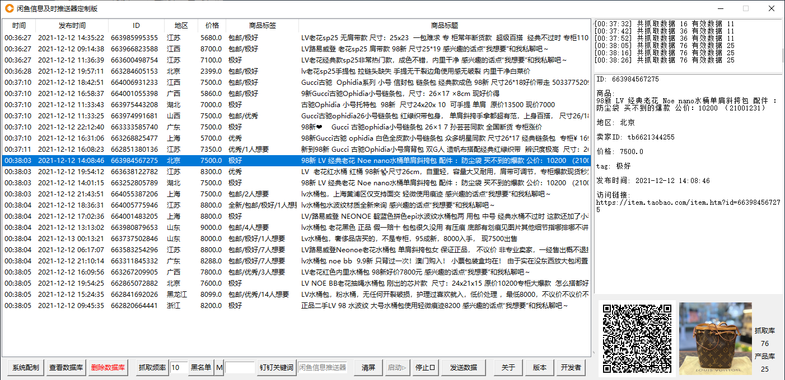

#### 1102 v 1.0.8 更新搜索入库分词优化

#### 10-30 v 1.0.8 更新预览图片。
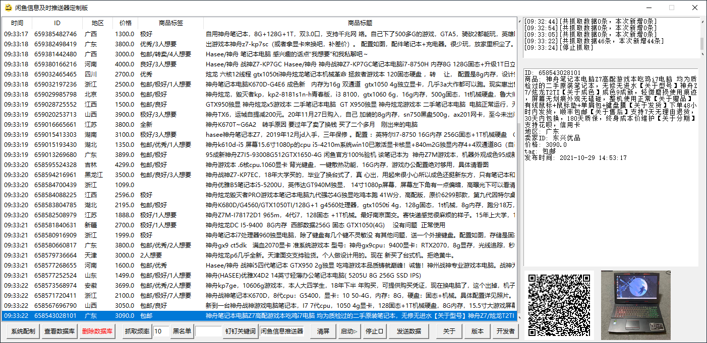
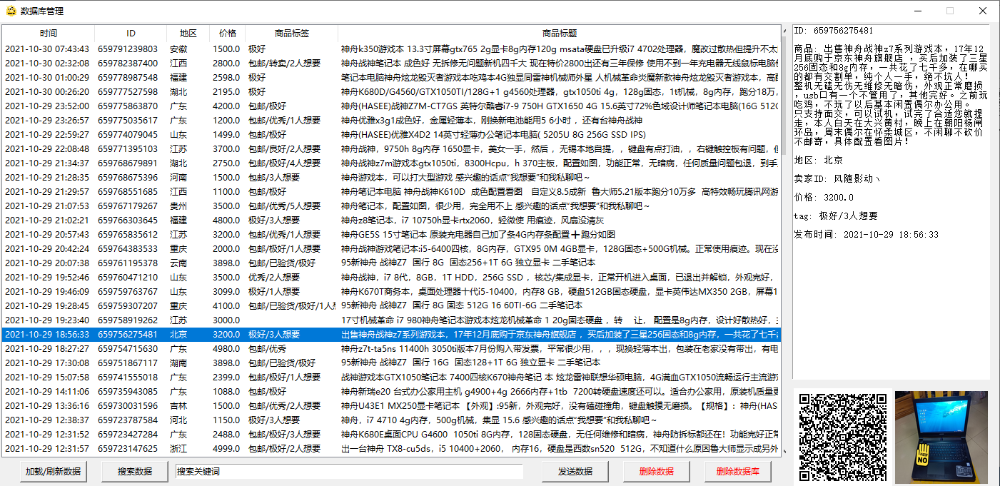

#### v 1.0.6 更新黑名单。
可以在客户端添加黑名单。

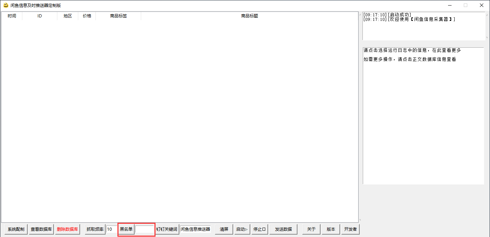

#### v 1.0.5 更新bug
因为闲鱼价格过万会变换显示方式，导致程序无法识别。
更新价格显示方式。

#### v 1.0.4更次更新
为抓取程序重构代码，并升级UI

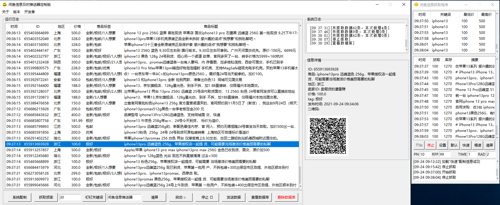

#### v 1.0.4更新抓取首页和数据库页面

再次更新，
将原来杂乱的列表型数据显示更新为表格，这样看起来就没有那么乱了。
更新下效果图：

#### v 1.0.3添加多终端采集

在分布式采集的基础上，再次添加同一终端上面的多线程采集，进一步提高采集效率。
采集端代码在原有基础上再次升级。

#### v 1.0.3已经升级完毕

抓取数据目前比较快的话，可以达到10秒钟入库体现，关键词多的话，会有一定延迟。

同时，数据库从本地移到服务器，开始使用远程连接和储存数据，更方便分布式搭建、站库分离，以及一服多客模式。

更重要的是，不再需要配制本地数据库，不会再因为本地数据库问题导致程序down掉。

虽然原来也写了自动化配制数据库的程序，但因为系统权限问题，始终不太理想。这次干脆干掉本地数据库，只需要一个客户端，为所欲为了。

#### v 1.0.1.2升级数据库启动文件，自动检测系统数据库配制情况。

#### 1 建议使用mongodb 4.2.14， 将mongod.exe移动到bin文件中

#### 2 运行数据库启动软件，自动建立数据库文件和日志文件。

#### 3 运行程序

