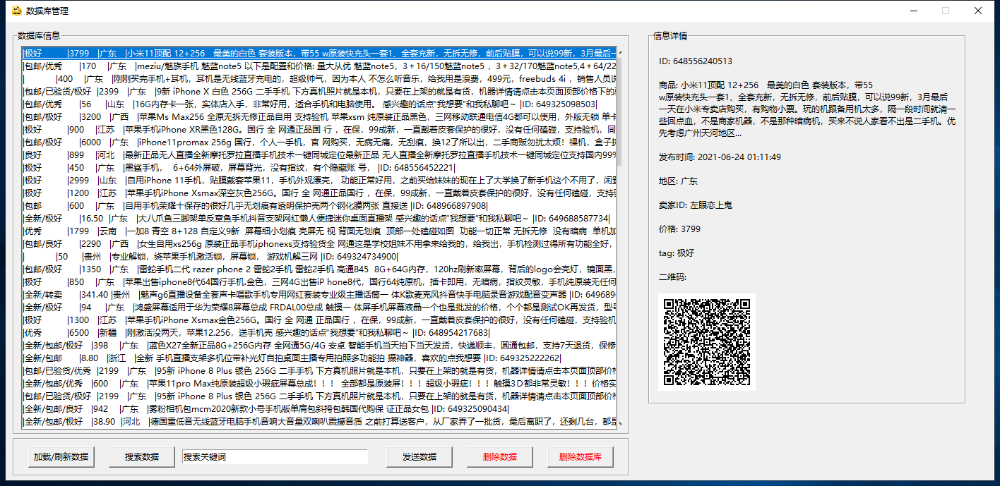
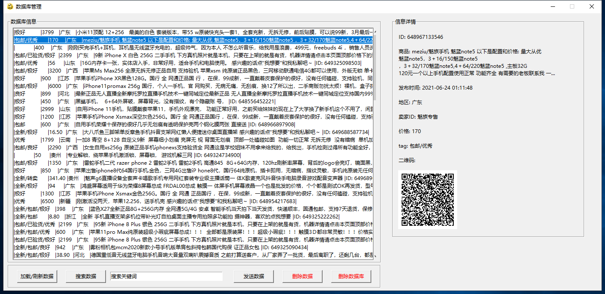

## xianyu-idlefish-spider-crawler-sender

## 闲鱼自动抓取/筛选/发送系统，xianyu spider crawler blablabla

#### v 1.0.3已经升级完毕

抓取数据目前比较快的话，可以达到10秒钟入库体现，关键词多的话，会有一定延迟。

同时，数据库从本地移到服务器，开始使用远程连接和储存数据，更方便分布式搭建、站库分离，以及一服多客模式。

#### v 1.0.1.2升级数据库启动文件，自动检测系统数据库配制情况。

#### 1 建议使用mongodb 4.2.14， 将mongod.exe移动到bin文件中

#### 2 运行数据库启动软件，自动建立数据库文件和日志文件。

#### 3 运行程序

